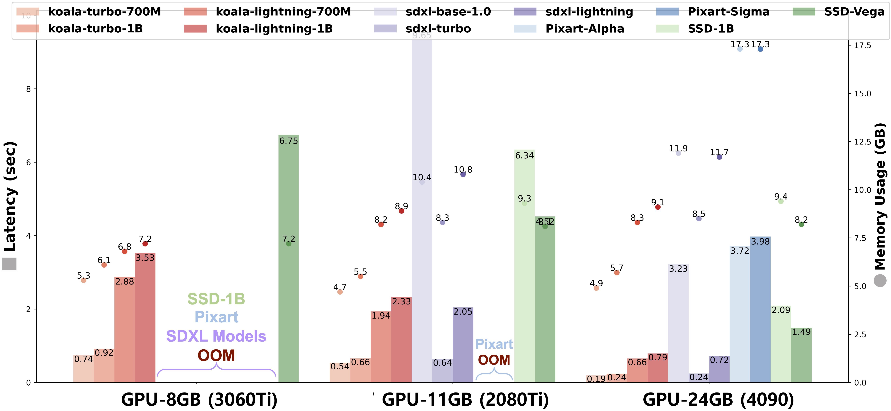

<!-- # KOALA: Self-Attention Matters in Knowledge Distillation of Latent Diffusion Models for Memory-Efficient and Fast Image Synthesis -->

<p align="left">
  
</p>

> **[KOALA: Empirical Lessons Toward Memory-Efficient and Fast Diffusion Models for Text-to-Image Synthesis](http://arxiv.org/abs/2312.04005)**<br>
> [Youngwan Lee](https://github.com/youngwanLEE)<sup>1,2</sup>, [Kwanyong Park](https://pkyong95.github.io/)<sup>1</sup>, [Yoorhim Cho](https://ofzlo.github.io/)<sup>3</sup>, [Young-Ju Lee](https://scholar.google.com/citations?user=6goOQh8AAAAJ&hl=en)<sup>1</sup>, [Sung Ju Hwang](http://www.sungjuhwang.com/)<sup>2,4</sup> <br>
> <sup>1</sup>ETRI <sup>2</sup>KAIST, <sup>3</sup>SMWU, <sup>4</sup>DeepAuto.ai <br>


<a href="https://youngwanlee.github.io/KOALA/"></a> &ensp;
<a href="https://arxiv.org/abs/2312.04005"></a> &ensp;
<a href="https://colab.research.google.com/drive/16gBq2J4fo8xCgmWaBvrqnEb-liAz6097?usp=sharing">
  
</a> &ensp;

## Abstract
### TL;DR
> We propose a fast text-to-image model, called KOALA, by compressing SDXL's U-Net and distilling knowledge from SDXL into our model. KOALA-Lightning-700M can generate a 1024x1024 image in 0.66 seconds on an NVIDIA 4090 GPU, which is more than 4x faster than SDXL. KOALA-700M can be used as a cost-effective alternative between SDM and SDXL in limited resources.

<details><summary>FULL abstract</summary>
As text-to-image (T2I) synthesis models increase in size, they demand higher inference costs due to the need for more expensive GPUs with larger memory, which makes it challenging to reproduce these models in addition to the restricted access to training datasets. 
Our study aims to reduce these inference costs and explores how far the generative capabilities of T2I models can be extended using only publicly available datasets and open-source models. 
To this end, by using the de facto standard text-to-image model, Stable Diffusion XL (SDXL), we present three key practices in building an efficient T2I model: (1) Knowledge distillation: we explore how to effectively distill the generation capability of SDXL into an efficient U-Net and find that self-attention is the most crucial part. 
(2) Data: despite fewer samples, high-resolution images with rich captions are more crucial than a larger number of low-resolution images with short captions.
(3) Teacher: Step-distilled Teacher allows T2I models to reduce the noising steps. 
Based on these findings, we build two types of efficient text-to-image models, called KOALA-Turbo &-Lightning, with two compact U-Nets (1B & 700M), reducing the model size up to 54% and 69% of the SDXL U-Net. 
In particular, the KOALA-Lightning-700M is 4x faster than SDXL while still maintaining satisfactory generation quality. 
Moreover, unlike SDXL, our KOALA models can generate 1024px high-resolution images on consumer-grade GPUs with 8GB of VRAMs (3060Ti). 
We believe that our KOALA models will have a significant practical impact, serving as cost-effective alternatives to SDXL for academic researchers and general users in resource-constrained environments.
</details>


## Qualitative results
These 1024x1024 samples are generated by KOALA-Lightning-700M with 10 denoising steps in 0.66 seconds on NVIDIA 4090 GPU.


## Latency and memory usage comparison on different GPUs
We measured the inference time of SDXL-Turbo and KOALA-Turbo models at a resolution of 512x512, and other models at 1024x1024, using a variety of consumer-grade GPUs: NVIDIA 3060Ti (8GB), 2080Ti (11GB), and 4090 (24GB). 'OOM' indicates Out-of-Memory. Note that SDXL models cannot operate on the 3060Ti with 8GB VRAM, whereas <b>our KOALA models can run on all GPU types.</b>




## Inference with 🧨 diffusers


You need to install some libraries:

```bash
pip install -U diffusers transformers accelerate safetensors
```

```python
import torch
from diffusers import StableDiffusionXLPipeline, EulerDiscreteScheduler

# You can replace the checkpoint id with several koala models as below:
# "etri-vilab/koala-lightning-700m"

pipe = StableDiffusionXLPipeline.from_pretrained("etri-vilab/koala-lightning-1b", torch_dtype=torch.float16)
pipe = pipe.to("cuda")

# Ensure sampler uses "trailing" timesteps and "sample" prediction type.
pipe.scheduler = EulerDiscreteScheduler.from_config(
    pipe.scheduler.config, timestep_spacing="trailing"
  )


prompt = "Albert Einstein in a surrealist Cyberpunk 2077 world, hyperrealistic"

# If you use negative prompt, you could get more stable and accurate generated images.
negative_prompt = '(deformed iris, deformed pupils, deformed nose, deformed mouse), worst  quality, low quality, ugly, duplicate, morbid,  mutilated, extra fingers, mutated hands, poorly drawn hands, poorly  drawn face, mutation, deformed, blurry, dehydrated, bad anatomy, bad  proportions, extra limbs, cloned face, disfigured, gross proportions,  malformed limbs, missing arms, missing legs'

image = pipe(prompt=prompt, negative_prompt=negative, guidance_scale=3.5, num_inference_steps=10).images[0]

image.save("./example.png")

```

## To-Do List

- [x]  Inference code
- [ ]  Training code

## LICENSE
Please refer to [LICENSE.md](./LICENSE.md) file.

## Acknowledgement

We would like to thank [BK-SDM](https://github.com/Nota-NetsPresso/BK-SDM) and this repository is built using [diffusers](https://github.com/huggingface/diffusers/blob/main/examples/text_to_image/README_sdxl.md) and [Stable Diffusion XL](https://huggingface.co/stabilityai/stable-diffusion-xl-base-1.0).

This work was supported by Institute of Information \& communications Technology Planning \& Evaluation (IITP) grant funded by the Korea government (MSIT) (No. RS-2022-00187238, Development of Large Korean Language Model Technology for Efficient Pre-training).


## 📖BibTeX
```bibtex
  @article{Lee2023koala,
          title={KOALA: Empirical Lessons Toward Memory-Efficient and Fast Diffusion Models for Text-to-Image Synthesis}, 
          author={Lee, Youngwan and Park, Kwanyong and Cho, Yoohrim and Lee, Yong Ju and Hwang, Sung Ju},
          journal={arXiv preprint arXiv:2312.04005},
          year={2023}
  }
```
