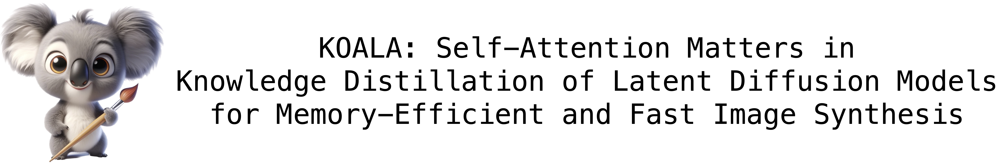
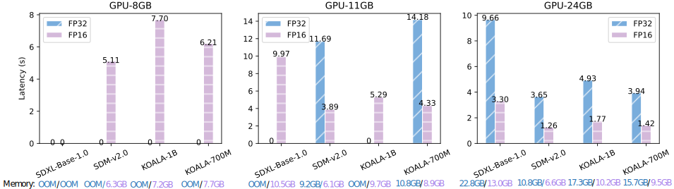

<!-- # KOALA: Self-Attention Matters in Knowledge Distillation of Latent Diffusion Models for Memory-Efficient and Fast Image Synthesis -->

<p align="left">
  
</p>

> **[KOALA: Self-Attention Matters in Knowledge Distillation of Latent Diffusion Models for Memory-Efficient and Fast Image Synthesis](http://arxiv.org/abs/2312.04005)**<br>
> [Youngwan Lee](https://github.com/youngwanLEE)<sup>1,2</sup>, [Kwanyong Park](https://pkyong95.github.io/)<sup>1</sup>, [Yoorhim Cho](https://ofzlo.github.io/)<sup>3</sup>, [Young-Ju Lee](https://scholar.google.com/citations?user=6goOQh8AAAAJ&hl=en)<sup>1</sup>, [Sung Ju Hwang](http://www.sungjuhwang.com/)<sup>2,4</sup> <br>
> <sup>1</sup>ETRI <sup>2</sup>KAIST, <sup>3</sup>SMWU, <sup>4</sup>DeepAuto.ai <br>


<a href="https://youngwanlee.github.io/KOALA/"></a> &ensp;
<a href="https://arxiv.org/abs/2312.04005"></a> &ensp;
<a href="https://colab.research.google.com/drive/1jWO_0WrXqTVLnOSOKfrfhpCjZyBuvmGg?usp=sharing">
  

## Abstract
### TL;DR
> We propose a fast text-to-image model, called KOALA, by compressing SDXL's U-Net and distilling knowledge from SDXL into our model. KOALA-700M can generate a 1024x1024 image in less than 1.5 seconds on an NVIDIA 4090 GPU, which is more than 2x faster than SDXL.

<details><summary>FULL abstract</summary>
Stable diffusion is the mainstay of the text-to-image (T2I) synthesis in the community due to its generation performance and open-source nature. 
Recently, Stable Diffusion XL (SDXL), the successor of stable diffusion, has received a lot of attention due to its significant performance improvements with a higher resolution of 1024x1024 and a larger model. 
However, its increased computation cost and model size require higher-end hardware (e.g., bigger VRAM GPU) for end-users, incurring higher costs of operation. 
To address this problem, in this work, we propose an efficient latent diffusion model for text-to-image synthesis obtained by distilling the knowledge of SDXL. 
To this end, we first perform an in-depth analysis of the denoising U-Net in SDXL, which is the main bottleneck of the model, and then design a more efficient U-Net based on the analysis. 
Secondly, we explore how to effectively distill the generation capability of SDXL into an efficient U-Net and eventually identify four essential factors, the core of which is that self-attention is the most important part. 
With our efficient U-Net and self-attention-based knowledge distillation strategy, we build our efficient T2I models, called KOALA-1B &-700M, while reducing the model size up to 54% and 69% of the original SDXL model. 
In particular, the KOALA-700M is more than twice as fast as SDXL while still retaining a decent generation quality. 
We hope that due to its balanced speed-performance tradeoff, our KOALA models can serve as a cost-effective alternative to SDXL in resource-constrained environments.
</details>


## Qualitative results
These 1024x1024 samples are generated by KOALA-700M with 25 denoising steps.


## Latency and memory usage comparison on different GPUs
We measure the inference time of SDM-v2.0 with 768x768 resolution and the other models with 1024x1024 using a variety of consumer-grade GPUs: NVIDIA 3060Ti (8GB), 2080Ti (11GB), and 4090 (24GB). We use 25 denoising steps and FP16/FP32 precisions. OOM means Out-of-Memory. Note that SDXL-Base cannot operate in the 8GB-GPU.




## Inference with 🧨 diffusers

You need to install some libraries:

```bash
pip install -U diffusers transformers accelerate safetensors
```

```python
import torch
from diffusers import StableDiffusionXLPipeline

# You can replace the checkpoint id with several koala models as below:
# "etri-vilab/koala-700m"
# "etri-vilab/koala-1b"
# "etri-vilab/koala-1b-llava-cap"

pipe = StableDiffusionXLPipeline.from_pretrained("etri-vilab/koala-700m-llava-cap", torch_dtype=torch.float16, use_safetensors=True, variant="fp16")
pipe = pipe.to('cuda')


prompt = "Albert Einstein in a surrealist Cyberpunk 2077 world, hyperrealistic"
pipe(prompt, num_inference_steps=25, guidance_scale=7.5).images[0]
image.save("./example.png")

# If you use negative prompt, you could get more stable and accurate generated images.

negative_prompt = '(deformed iris, deformed pupils, deformed nose, deformed mouse), worst  quality, low quality, ugly, duplicate, morbid,  mutilated, extra fingers, mutated hands, poorly drawn hands, poorly  drawn face, mutation, deformed, blurry, dehydrated, bad anatomy, bad  proportions, extra limbs, cloned face, disfigured, gross proportions,  malformed limbs, missing arms, missing legs'

pipe(prompt, negative_prompt=neg_prompt, num_inference_steps=25, guidance_scale=7.5).images[0]
image.save("./example.png")
```

## To-Do List

- [x]  Inference code
- [ ]  Training code

## LICENSE
Please refer to [LICENSE.md](./LICENSE.md) file.

## Acknowledgement

We would like to thank [BK-SDM](https://github.com/Nota-NetsPresso/BK-SDM) and this repository is built using [diffusers](https://github.com/huggingface/diffusers/blob/main/examples/text_to_image/README_sdxl.md) and [Stable Diffusion XL](https://huggingface.co/stabilityai/stable-diffusion-xl-base-1.0).

This work was supported by Institute of Information \& communications Technology Planning \& Evaluation (IITP) grant funded by the Korea government (MSIT) (No. RS-2022-00187238, Development of Large Korean Language Model Technology for Efficient Pre-training).


## 📖BibTeX
```bibtex
  @article{Lee2023koala,
          title={KOALA: Self-Attention Matters in Knowledge Distillation of Latent Diffusion Models for Memory-Efficient and Fast Image Synthesis}, 
          author={Lee, Youngwan and Park, Kwanyong and Cho, Yoohrim and Lee, Yong Ju and Hwang, Sung Ju},
          journal={arXiv preprint arXiv:2312.04005},
          year={2023}
  }
```
